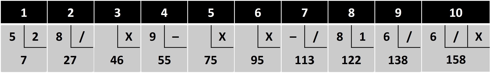

# Bowling_Kata
### 關於這個套路
#### 參考
- [Coding Dojo](https://codingdojo.org/kata/Bowling/)
- [Uncle Bob](http://butunclebob.com/ArticleS.UncleBob.TheBowlingGameKata)
- [維基百科](https://zh.wikipedia.org/zh-tw/%E4%BF%9D%E9%BD%A1%E7%90%83)

### 專有名詞 / 術語
- 局 ( Game )
- 計分格 ( Frame )
- 投球 ( Roll )
- 球瓶 ( Pins )
- 全倒 ( Strike )：第一球全倒
- 補中 ( Spare )：第一球未全倒，第二球全倒
- 完美局 ( Perfect Game )：單局最高分都是 300 分，即連續投出 12 個 Strike，每個計分格得 30 分
- 火雞 ( Turkey )：連續三次全倒
- 洗溝 （Gutter Ball）：球沒有擊中任何球瓶

### 規則
- 一場保齡球賽有 10 局
- 每局有 10 個球瓶，每擊倒 1 個球瓶得 1 分
- 前 9 局每局有 2 顆球
- 第 10 局如果有 Strike 可再打兩球，Spare 可再打一球
- 每局的分數為當局擊倒球瓶數加上 Bonus

### Bonus
- Strike：Bonus 為本局分數加下兩球擊倒的瓶數
- Spare：Bonus 為本局分數加下一球擊倒的瓶數
- 第 10 局沒有 Bonus，
但 Strike 可再打兩球，Spare 可再打一球

### 計分劃記符號
|||
| :----: | :----: |
| X | 全中 (Strike) |
| / | 補中 (Spare) |
| 1-9 | 擊倒球數 |
| – | 洗溝 (Gutter Ball) |

### 計分板

- 第一格
  - 第一次投擲 5 分
  - 第二次投擲 2 分
  - 總得分 7 分 ( 5 + 7 )
- 第二格
  - 第一次投擲 8 分
  - 第二次投擲 Spare
  - Bonus 再投擲一球得 10 分
  - 總得分 27 分 ( 7 + 8 + 2 + 10 )
- 第三格
  - 第一次投擲 Strike
  - Bonus 再投擲兩球得 6 分
  - 總得分 43 分 ( 27 + 10 + 6 )
- 第四格
  - 第一次投擲 9 分
  - 第二次投擲 洗溝
  - 總得分 52 分 ( 43 + 9 + 0 )
- 第五格
  - 第一次投擲 Strike
  - Bonus 再投擲兩球得 13 分
  - 總得分 75 分 ( 52 + 10 + 13 )
- 第六格
  - 第一次投擲 Strike
  - Bonus 再投擲兩球得 15 分
  - 總得分 100 分 ( 75 + 10 + 15 )
- 第七格
  - 第一次投擲 洗溝
  - 第二次投擲 Spare
  - Bonus 再投擲一球得 6 分
  - 總得分 116 分 ( 100 + 0 + 10 + 6 )
- 第八格
  - 第一次投擲 8 分
  - 第二次投擲 1 分
  - 總得分 125 分 ( 116 + 8 + 1 )
- 第九格
  - 第一次投擲 6 分
  - 第二次投擲 Spare
  - 總得分 135 分 ( 125 + 6 + 4 )
- 第十格
  - 第一次投擲 6 分
  - 第二次投擲 Spare
  - Bonus 再投擲一球得 10 分
  - 總得分 155 分 ( 135 + 6 + 4 + 10 )
### code 設計
|||
| :----: | :---- |
| class | Game |
| methods | + roll (pins:int) + score():int |

#### class 名稱為 Game，它有兩個 methods
#### roll (pins : int)：每投擲 1 顆球就呼叫此方法一次，參數為當球擊倒的瓶數
#### score()：所有球打完後呼叫此方法，會回傳總分，型態為 int
